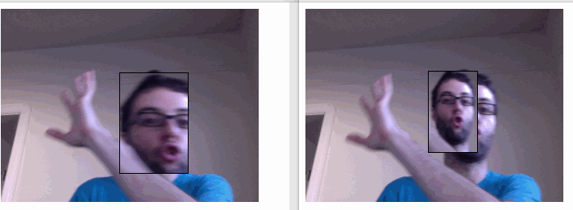

FACESWPPR
--------------------

Uses [headtrackr](https://github.com/auduno/headtrackr/) to detect yr face on webcam, and emits that face data through [socket.io](http://socket.io), while receiving face data from other people that is then drawn over yr face.

If you run it solo AKA node-less AKA gh-pages it will just [replace yr face with a cat face.](https://github.com/coleww/faceswappr)

